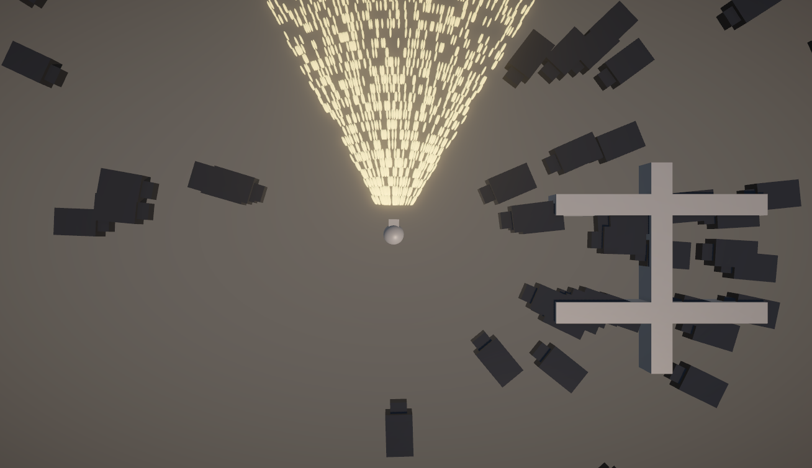
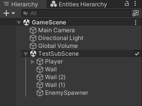
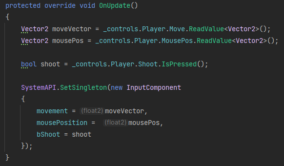
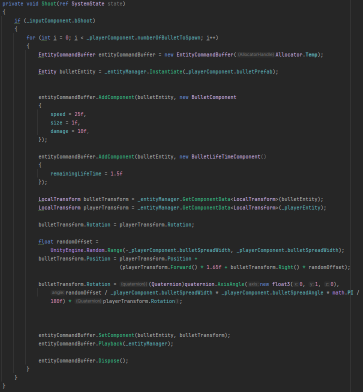
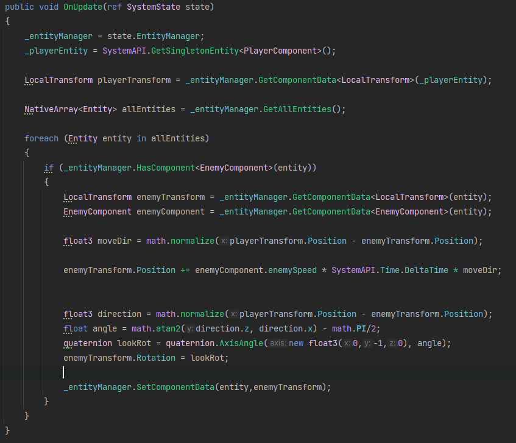

# ECS Practice

This is a simple top-down shooting game using Unity DOTs.
*In game*  

The game scene is at ``Assets\Scenes\SampleScene\GameScene``

please tick the subscene ``TestSubScene`` to activate it.

*Tick Subscene*  

## Operations

Use ```WASD``` to move the player in the window. The player will face the mouse position, and shoot in that direction when you press ```left click```.

The enemies will be spawned around the player again and again after time intervals.

## ECS Use

### Player & Input
``InputSystem `` reads the input from unity new input system, and then stores in ``InputComponent``.

*OnUpdate of InputSystem*  

``PlayerSystem`` moves, looks at mouse and shoots at mouse according to the inputs in ``InputComponent``

### Bullet
When press ```left click```, player shoots, at same time a lot of bullets will be instantiate by entityCommandBuffer in Shoot function of ``PlayerSystem``, with their initial positions and rotations.
*Shoot of PlayerSystem*  

After that, all bullets will be managed by ``BulletSystem``, move along their inital direction, decrease their lifetime, collide with specified objects(```Wall```s, ```Enemy```s), do the damage and destroy themselves.

### Enemy
Enemy will be spawned in random place atound the player by ``EnemySpawnerSystem``.
And then every enemy faces and moves towards the player, under the control of ``EnemySystem``.

*OnUpdate of EnemySystem* 